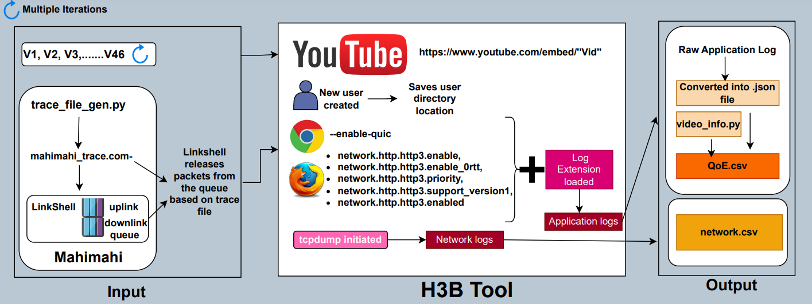

# H3B Dataset: HTTP/3 supported Browser Dataset

<!-- TABLE OF CONTENTS -->
<details>
  <summary>Table of Contents</summary>
  <ul>
    <li>
      <a href="#h3b-architecture">H3B Architecture</a>
    </li>
    <li>
      <a href="#running-the-experimental-setup">Running the Experimental Setup</a>
    </li>
    <li>
      <a href="#retrieving-qoe-parameters-from-application-logs">Retrieving QoE Parameters from Application Logs</a>
    </li>
  </ul>
</details>

## H3B Architecture


## Running the Experimental Setup

This section provides instructions on how to run the experimental setup and manipulate the input parameters to obtain the desired output. Follow the steps below:

1. Create the following folder hierarchy inside the **automated** folder:

```
automated
├── pcaps           <!-- network logs -->
└── logs-collected  <!-- application logs -->
```

2. Open **automate/video-groups/video-ids.txt** and insert the video IDs of the YouTube videos you want to run. Ensure there are no empty lines at the end of the file. Refer to the provided sample file for the format.

3. Open **automate/tcpdump_start.sh** and modify **Line-7** to specify the network interface that will be used to collect the network logs.

4. Open **automate/automate_chrome.sh** (or based on the browser preference). 

    * **Line-45** to **Line-64** correspond to QUIC-enabled stream.
    * **Line-66** to **Line-82** correspond to QUIC-disabled stream.

&emsp;&emsp;&emsp;You can comment/uncomment appropriate lines based on your requirement.

5. Open **automate/run.sh** file and modify the following parameters:
  
    * **Line-6** sets the number of slots you want to run a video.
    * Comment/uncomment/add/remove **Lines-9** to **Line-11** based on your requirements.
    * Choose the browser (Chrome, Chromium, or Firefox) by running the corresponding script (e.g., automate_chrome.sh).
    * Select the desired bandwidth pattern (e.g., "dynamic-high.com-", "dynamic-low.com-", "64-256-64-inc.com-") or use one of the provided trace files (located in the **mahimahi-trace-files** folder).

6. Once you have reviewed and adjusted the input parameters, open the terminal from the **automate** folder and run the following command to automatically run the setup and collect both application and network logs:
```sh
bash run.sh
```

7. After running all the videos, you can find the network and application logs inside the **pcaps** and **logs-collected** folders, respectively.

Follow these steps to run the experimental setup and manipulate the input parameters to obtain the desired output.

<p align="right">(<a href="#h3b-dataset-http3-supported-browser-dataset">back to top</a>)</p>

## Retrieving QoE Parameters from Application Logs

This section provides step-by-step instructions on how to use the application logs to retrieve QoE (Quality of Experience) parameters such as bitrate, avg_bitrate, avg_bitrate_variation, and avg_stall. Follow the steps below:

1. Create the following folder hierarchy:
```
.
├── ...
├── data
│ ├── logFiles
│ │ └── slot
│ │ │ └── dynamic-very-low
│ │ │ │ ├── tcp---tcp_qoe
│ │ │ │ ├── quic---quic_qoe
│ ├── jsonFiles
│ │ └── slot
│ │ │ └── dynamic-very-low
│ │ │ │ ├── tcp---tcp_qoe
│ │ │ │ ├── quic---quic_qoe
│ └── csvFiles
│ │ └── slot
│ │ │ └── 64-256-64-inc
│ │ │ │ ├── tcp---tcp_qoe
│ │ │ │ ├── quic---quic_qoe
└── ...
```

2. Place the application logs in the **logFiles** folder and organise them between **tcp** and **quic** folders.

3. Open the terminal and run the following command which will generate **tcp** and **quic** files inside the **jsonFiles** folder. 
```
.\create_graphs_slot.bat
```

4. Run the following command in the terminal which will generate both **tcp** and **quic** QoE files under the **csvFiles** folder. 
```
.\scripts\get_json.py slot dynamic-very-low
```
**NOTE:** We have added both **tcp** and **quic** QoE files inside the **application-logs-qoe** collected over 5 geographical locations under **dynamic-high**, **dynamic-low** and **dynamic-very-low**. 

Make sure to follow these steps to effectively retrieve the QoE parameters from the application logs.

<p align="right">(<a href="#h3b-dataset-http3-supported-browser-dataset">back to top</a>)</p>

The raw application and network logs(pcaps) can be found [here](https://drive.google.com/drive/folders/1MsywvxEPOHagHO6JAQ9FPTGLHV17t638?usp=sharing)
